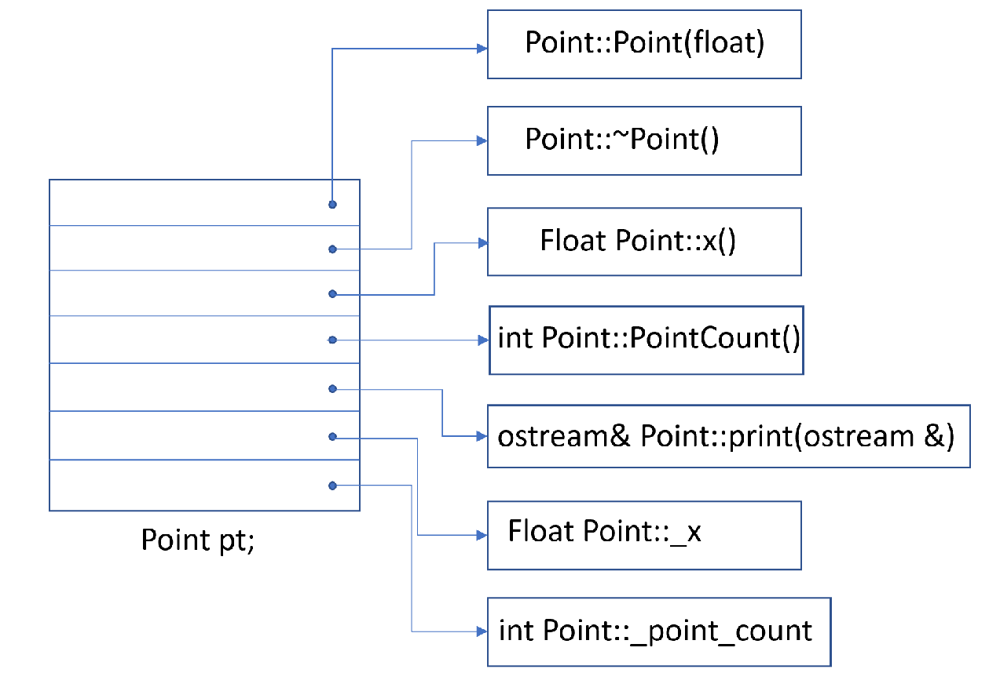
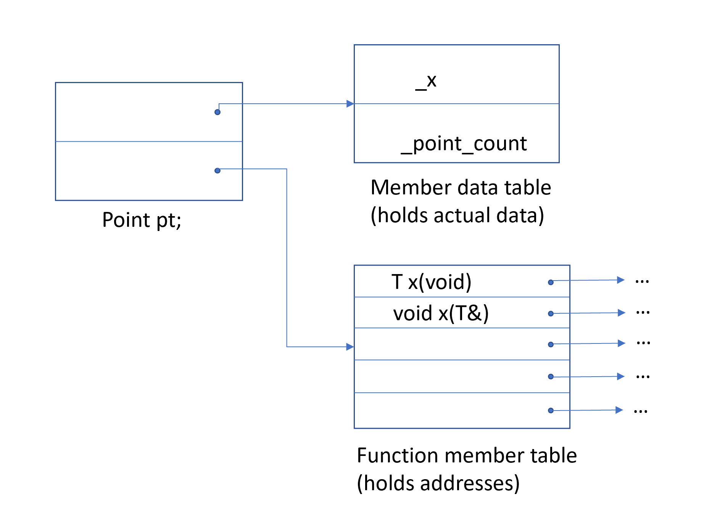
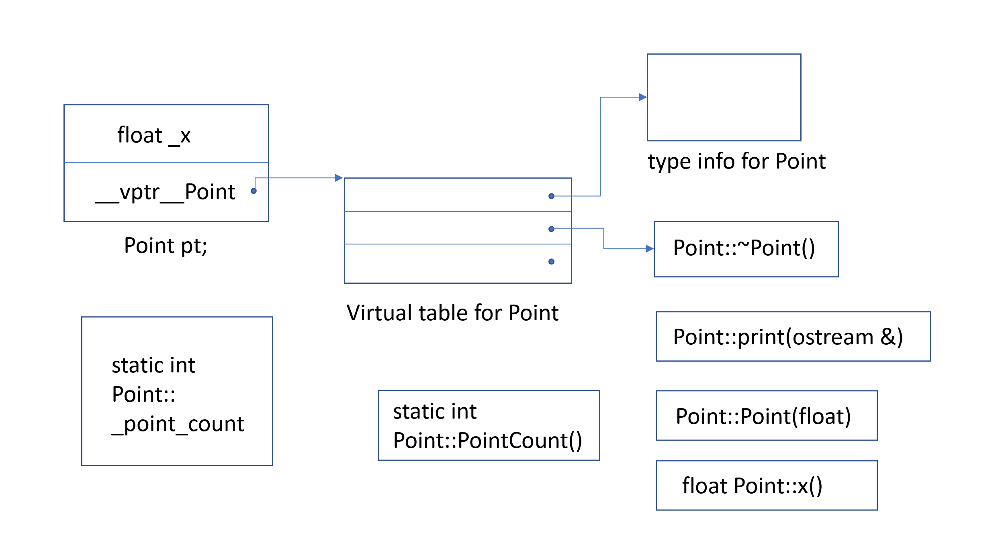

Layout Costs for Adding Encapsulation

An obvious question a programmer might ask while looking at the transformed Point3d implementations
under C++ concerns the layout costs for adding encapsulation. The answer is that there are no
additional layout costs for supporting the class Point3d. The three coordinate data members are
directly contained within each class object, as they are in the C struct. The member functions, 
although included in the class declaration, are not reflected in the object layout; one copy
only for each non-inline member function is generated. Each inline function has either zero or 
one definition of itself generated within each module in which it is used. The Point3d class
has no space or runtime penalty in supporting encapsulation. As you will see, the primary 
layout and access-time overheads within C++ are associated with the virtuals, that is

* the virtual function mechanism in its support of an efficient run-time binding, and
* a virtual base class in its support of a single instance of a base class occuring
multiple times within the inheritance hierarchy

There is also additional overhead under multiple inheritance in the conversion between derived
class and its second or subsequent base class. In general, however, there is no inherent reason
a program in C++ need be any larger or slower than its equivalent C program.

The C++ Object Model 

In C++ there are two flavors of class data members - static and nonstatic - and three flavors of 
class member functions - static, nonstatic and virtual. Given the following declaration of class
Point:
```cpp
class Point
{
public:
   Point ( float xval );
   virtual ~Point();


   float x() const;
   static int PointCount();

protected:
   virtual ostream&
      print ( ostream &os ) const;

   float _x;
   static int _point_count; 

};
```
how is the class Point to be represented within the machine? That is, how do we model the various 
flavors of data and function members?

A Simple Object Model



In this simple model, the members themselves are not placed within the object. Only pointers
addressing the members are placed within the object. Doing this avoids problems from member's
being quite different types and requiring different amounts (and sometimes different types of)
storage. Members within an object are addressed by their slot's index. For example, ```_x```'s
index is 6 and ```_point_count```'s index is 7. The general size of a class object is the size
of a pointer multiplied by the number of members declared by the class. Although this model is 
not used in practice, this simple concept of an index or slot number is the one that has been
developed into the C++ pointer-to-member concept.

A Table-Driven Object Model

For an implementation to maintain a uniform representation for the objects of all classes, an
alternative object model might factor out all member specific information, placing it in data
member and member function pair of tables. The class object contains the pointers to the two
member tables. The member function table is a sequence of slots with each slot addressing a
member. The data member table directly holds the data. This is shown on the figure below.


Member Table Object Model



Although this model is not used in practice within C++, the concept of a member function table
has been the traditional implementation supporting efficient runtime resolution of virtual 
functions. At least one implementation of the CORBA ORB has used a form of this two table model.
The Simple Object Model also relies on this two table model.

The C++ Object Model

Stroustrup's original (and still prevailing) C++ Object Model is derived from the simple object
model by optimizing for space and access time. Nonstatic data members are allocated directly
within each class object. Static data members are stoed outside the individual class object.
Static and nonstatic function members are hoisted outside the class object. Virtual functions are
supported in two steps:

1. A table of pointers to virtual functions is generated for each class (this is called the virtual 
table).

2. A single pointer to the associated virtual table is inserted within each class object (traditionally
this has been called the vptr). The setting, resetting, and not setting of the vptr is handled 
automatically through code generated within each class constructor, destructor, and copy assignment
operator. The type_info object associated with each class in support of runtime type identification (RTTI)
is also addressed within the virtual table usually within the table's first slot.

The figure below illustrates the general C++ object model for our Point class. The primary strength of 
the C++ object model is its space and running efficiency. Its primary drawback is the need to recompile
unmodified code that makes use of an object of a class for which there has been an addition, removal, 
or modification of the nonstatic class data members. The two table data mode, for example, offers more
flexibility by providing an additional level of indirection. But it does this at the cost of space
and runtime efficiency.



Adding Inheritance

C++ supports both _single_ inheritance:

```cpp
class Library_materials { ... };
class Book : public Library_materials { ... };
class Rental_book : public Book { ... };
```

and _multiple_ inheritance:
```cpp
// original pre-Standard iostream implementation
class iostream:
   public istream,
   public ostream { ... };
```

Moreover, the inheritance may be specified as _virtual_ (that is, shared):

```cpp
class istream : virtual public ios { ... };
class ostream : virtual public ios { ... };
```

In the case of virtual inheritance, only a single occurence of the base class is 
maintained (called a _subobject_) regardless of how many times the class is derived
 from within the inheritance chain. iostream, for example, contains only a single
instance of the virtual ios base class.

How might a derived class internally model its base class instance? In a simple 
base class object model, each base class might be assigned a slot within the 
derived class object. Each slot holds the address of the base class subobject. 
The primary drawback to this scheme is the space and access-time overhead of the 
indirection. A benefit is that the size of the class object is unaffected by changes
in the size of its associated base classes.

Alternatively, one can imagine a base table model. Here, a base class table is 
generated for which each slot contains the address of an associated base class,
much as the virtual table holds the address of each virtual function. Each class
object contains a _bptr_ initialized to address its base class table. The primary
drawback to this strategy, of course, is both the space and access-time overhead of
the indirection. One benefit is a uniform representation of inheritance within each
class object. Each class object would contain a base table pointer at some fixed
location regardless of the size or number of its base classes. A second benefit would
be the ability to grow, shrink, or otherwise modify the base class table without 
changing the size of the class object themselves.

In both schemes, the degree of indirection increases with the depth of the inheritance
chain; for example, a Rental_book requires two indirections to access an inherited 
member of its Library_materials class, whereas Book requires only one. A uniform access
time could be gained by duplicating within the derived class a pointer to each base
class within the inheritance chain. The tradeoff is in the additional space required to 
maintain the additional pointers.

The original inheritance model supported by C++ forgoes all indirection; the data members
of the base class subobject are directly stored within the derived class object.
This offers the most compact and most efficient access of the base class members. The drawback,
of course, is that any change to the base class members, such as adding, removing, or changing
a member's type, requires that all code using objects of the base class or any class derived
from it be recompiled.

The introduction of virtual base classes into the language at the time of Release 2.0 required
some form of indirect base class representation. The original model of virtual base class
support added a pointer into the class object for each associated virtual base class.
Alternative models have evolved that either introduce a virtual base class table or augment the
existing virtual table to maintain the location of each virtual base class.

How the Object Model Effects Programs

In practice, what does this mean for the programmer? Support for the object model results in
both modifications of the existing program code and the insertion of additional code. 
For example, given the following function, where class X defines a copy constructor, virtual
destructor, and virtual function ```foo()```: 

```cpp
X foobar()
{
   X xx;
   X *px = new X;

   // foo() is virtual function
   xx.foo();
   px->foo();

   delete px;
   return xx;
};
```

the likely internal transformation of the function looks as follows:

```cpp
// Probable internal transformation
// Pseudo C++ code
void foobar( X &_result )
{
    // construct _result
    // _result replaces local xx ...
    _result.X::X();

    // expand X *px = new X;
    px = _new( sizeof( X ));
    if ( px != 0 )
        px->X::X();

    // expand xx.foo(): suppress virtual mechanism
    // replace xx with _result
    foo( &_result );

    // expand px->foo() using virtual mechanism
    ( *px->_vtbl[ 2 ] )( px )
    // expand delete px;
    if ( px != 0 ) {
       ( *px->_vtbl[ 1 ] ) ( px ); // destructor
       _delete( px );
    }

    // replace named return statement
    // no need to destroy local object xx
    return; 
}
```
