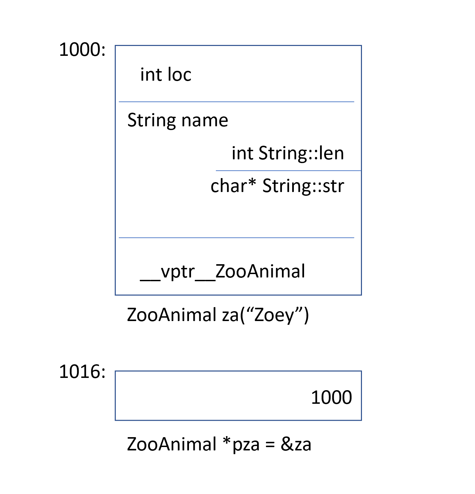
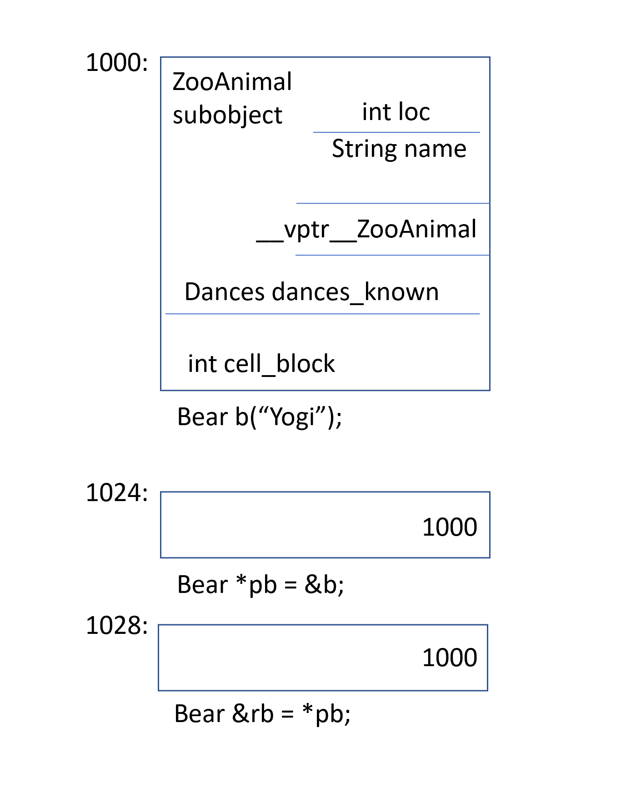
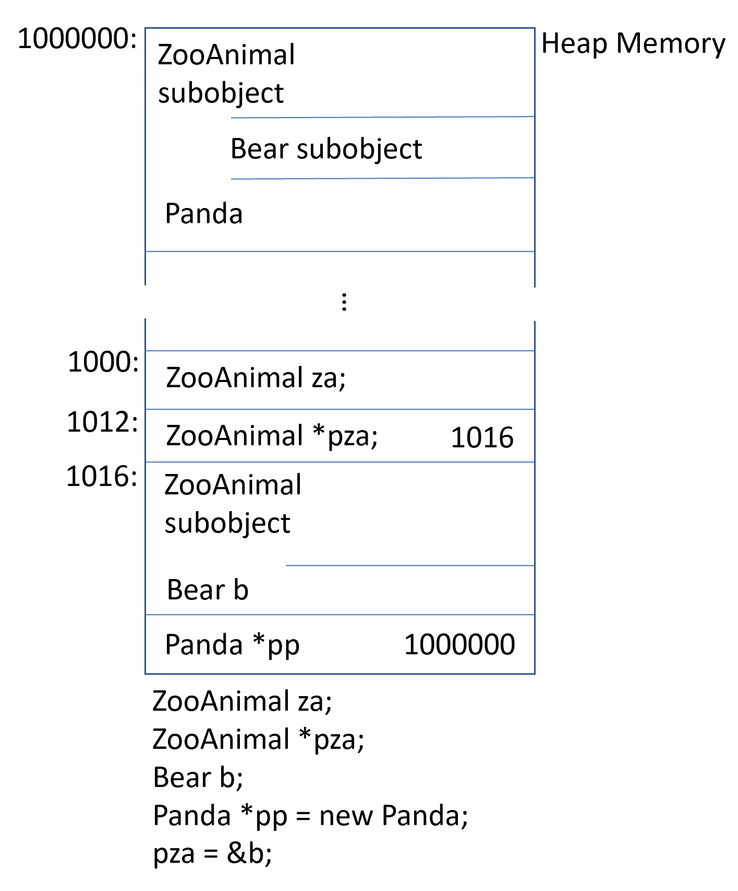

Layout Costs for Adding Encapsulation

An obvious question a programmer might ask while looking at the transformed Point3d implementations
under C++ concerns the layout costs for adding encapsulation. The answer is that there are no
additional layout costs for supporting the class Point3d. The three coordinate data members are
directly contained within each class object, as they are in the C struct. The member functions, 
although included in the class declaration, are not reflected in the object layout; one copy
only for each non-inline member function is generated. Each inline function has either zero or 
one definition of itself generated within each module in which it is used. The Point3d class
has no space or runtime penalty in supporting encapsulation. As you will see, the primary 
layout and access-time overheads within C++ are associated with the virtuals, that is

* the virtual function mechanism in its support of an efficient run-time binding, and
* a virtual base class in its support of a single instance of a base class occuring
multiple times within the inheritance hierarchy

There is also additional overhead under multiple inheritance in the conversion between derived
class and its second or subsequent base class. In general, however, there is no inherent reason
a program in C++ need be any larger or slower than its equivalent C program.

The C++ Object Model 

In C++ there are two flavors of class data members - static and nonstatic - and three flavors of 
class member functions - static, nonstatic and virtual. Given the following declaration of class
Point:
```cpp
class Point
{
public:
   Point ( float xval );
   virtual ~Point();


   float x() const;
   static int PointCount();

protected:
   virtual ostream&
      print ( ostream &os ) const;

   float _x;
   static int _point_count; 

};
```
how is the class Point to be represented within the machine? That is, how do we model the various 
flavors of data and function members?

A Simple Object Model


In this simple model, the members themselves are not placed within the object. Only pointers
addressing the members are placed within the object. Doing this avoids problems from member's
being quite different types and requiring different amounts (and sometimes different types of)
storage. Members within an object are addressed by their slot's index. For example, ```_x```'s
index is 6 and ```_point_count```'s index is 7. The general size of a class object is the size
of a pointer multiplied by the number of members declared by the class. Although this model is 
not used in practice, this simple concept of an index or slot number is the one that has been
developed into the C++ pointer-to-member concept.

A Table-Driven Object Model

For an implementation to maintain a uniform representation for the objects of all classes, an
alternative object model might factor out all member specific information, placing it in data
member and member function pair of tables. The class object contains the pointers to the two
member tables. The member function table is a sequence of slots with each slot addressing a
member. The data member table directly holds the data. This is shown on the figure below.


Member Table Object Model


Although this model is not used in practice within C++, the concept of a member function table
has been the traditional implementation supporting efficient runtime resolution of virtual 
functions. At least one implementation of the CORBA ORB has used a form of this two table model.
The Simple Object Model also relies on this two table model.

The C++ Object Model

Stroustrup's original (and still prevailing) C++ Object Model is derived from the simple object
model by optimizing for space and access time. Nonstatic data members are allocated directly
within each class object. Static data members are stoed outside the individual class object.
Static and nonstatic function members are hoisted outside the class object. Virtual functions are
supported in two steps:

1. A table of pointers to virtual functions is generated for each class (this is called the virtual 
table).

2. A single pointer to the associated virtual table is inserted within each class object (traditionally
this has been called the vptr). The setting, resetting, and not setting of the vptr is handled 
automatically through code generated within each class constructor, destructor, and copy assignment
operator. The type_info object associated with each class in support of runtime type identification (RTTI)
is also addressed within the virtual table usually within the table's first slot.

The figure below illustrates the general C++ object model for our Point class. The primary strength of 
the C++ object model is its space and running efficiency. Its primary drawback is the need to recompile
unmodified code that makes use of an object of a class for which there has been an addition, removal, 
or modification of the nonstatic class data members. The two table data mode, for example, offers more
flexibility by providing an additional level of indirection. But it does this at the cost of space
and runtime efficiency.


Adding Inheritance

C++ supports both _single_ inheritance:

```cpp
class Library_materials { ... };
class Book : public Library_materials { ... };
class Rental_book : public Book { ... };
```

and _multiple_ inheritance:
```cpp
// original pre-Standard iostream implementation
class iostream:
   public istream,
   public ostream { ... };
```

Moreover, the inheritance may be specified as _virtual_ (that is, shared):

```cpp
class istream : virtual public ios { ... };
class ostream : virtual public ios { ... };
```

In the case of virtual inheritance, only a single occurence of the base class is 
maintained (called a _subobject_) regardless of how many times the class is derived
 from within the inheritance chain. iostream, for example, contains only a single
instance of the virtual ios base class.

How might a derived class internally model its base class instance? In a simple 
base class object model, each base class might be assigned a slot within the 
derived class object. Each slot holds the address of the base class subobject. 
The primary drawback to this scheme is the space and access-time overhead of the 
indirection. A benefit is that the size of the class object is unaffected by changes
in the size of its associated base classes.

Alternatively, one can imagine a base table model. Here, a base class table is 
generated for which each slot contains the address of an associated base class,
much as the virtual table holds the address of each virtual function. Each class
object contains a _bptr_ initialized to address its base class table. The primary
drawback to this strategy, of course, is both the space and access-time overhead of
the indirection. One benefit is a uniform representation of inheritance within each
class object. Each class object would contain a base table pointer at some fixed
location regardless of the size or number of its base classes. A second benefit would
be the ability to grow, shrink, or otherwise modify the base class table without 
changing the size of the class object themselves.

In both schemes, the degree of indirection increases with the depth of the inheritance
chain; for example, a Rental_book requires two indirections to access an inherited 
member of its Library_materials class, whereas Book requires only one. A uniform access
time could be gained by duplicating within the derived class a pointer to each base
class within the inheritance chain. The tradeoff is in the additional space required to 
maintain the additional pointers.

The original inheritance model supported by C++ forgoes all indirection; the data members
of the base class subobject are directly stored within the derived class object.
This offers the most compact and most efficient access of the base class members. The drawback,
of course, is that any change to the base class members, such as adding, removing, or changing
a member's type, requires that all code using objects of the base class or any class derived
from it be recompiled.

The introduction of virtual base classes into the language at the time of Release 2.0 required
some form of indirect base class representation. The original model of virtual base class
support added a pointer into the class object for each associated virtual base class.
Alternative models have evolved that either introduce a virtual base class table or augment the
existing virtual table to maintain the location of each virtual base class.

How the Object Model Effects Programs

In practice, what does this mean for the programmer? Support for the object model results in
both modifications of the existing program code and the insertion of additional code. 
For example, given the following function, where class X defines a copy constructor, virtual
destructor, and virtual function ```foo()```: 

```cpp
X foobar()
{
   X xx;
   X *px = new X;

   // foo() is virtual function
   xx.foo();
   px->foo();

   delete px;
   return xx;
};
```

the likely internal transformation of the function looks as follows:

```cpp
// Probable internal transformation
// Pseudo C++ code
void foobar( X &_result )
{
    // construct _result
    // _result replaces local xx ...
    _result.X::X();

    // expand X *px = new X;
    px = _new( sizeof( X ));
    if ( px != 0 )
        px->X::X();

    // expand xx.foo(): suppress virtual mechanism
    // replace xx with _result
    foo( &_result );

    // expand px->foo() using virtual mechanism
    ( *px->_vtbl[ 2 ] )( px )
    // expand delete px;
    if ( px != 0 ) {
       ( *px->_vtbl[ 1 ] ) ( px ); // destructor
       _delete( px );
    }

    // replace named return statement
    // no need to destroy local object xx
    return; 
}
```

A Keyword Distinction

Because C++ strives to maintain (as close as possible) language compatibility with C, C++
is considerably more complicated than it would otherwise be. For example, overload function
resolution would be a lot simpler if there were not eight flavors of integers to support.
Similarly, if C++ were to throw off the C declaration syntax, lookahead would not be required
to determine that the following is an invocation of ```pf``` rather than its definition:

```cpp
// don't know if declaration or invocation
// until see the integer constant 1024
int ( *pf ) ( 1024 );
```

On the following declaration, lookahead does not even work:

```cpp
// meta-language rule:
// declaration of pq, not invocation
int ( *pq )( );
```

A meta-language rule is required, dictating that when the language cannot distinguish between 
a declaration and an expression, it is to be interpreted as a declaration.

Similarly, the concept of a class could be supported by a single ```class``` keyword, if C++ were not
required to support existing C code and, with that, the keyword ```struct```. 

An Object Distinction

The C++ programming model directly supports three programming paradigms:

1. The _procedural model_ as programmed in C, and, of course, supported within C++. An example of this
is string manipulation using character arrays and the family of ```str*``` functions defined in the
Standard C library:

```cpp
char boy[] = "Danny";
char *p_son;
...
p_son = new charp strlen( boy ) + 1 ];
strcpy( p_son, boy );
...
if ( !strcmp( p_son, boy ))
   take_to_disneyland( boy );
```

2. The _abstract data type (ADT) model_ in which users of the abstraction are provided with a set of
operations (the public interface), while the implementation remains hidden. An example of this is a
String class:

```cpp
String girl = "Anna";
String daughter;
...
// String::operator=();
daughter = girl;
...
// String::operator==();
if ( girl == daughter )
    take_to_disneyland( girl );
```

3. The _object-oriented (OO) model_ in which a collection of related types are encapsulated through an
abstract base class providing a common interface. An example of this is a Library_materials class from
which actual subtypes such as ```Book```, ```Video```, ```Compact_Disc```, ```Puppet``` and ```Laptop```
 are derived:

```cpp
void check_in( Library_materials *pmat )
{
    if ( pmat->late() )
       pmat->fine();
    pmat->check_in();
    if ( Lender *plend = pmat->reserved() )
       pmat->notify( plend ); 

}
```

Programs written purely in the idiom of any one of these paradigms tend to be well behaved. Mixed
paradigm, however, hold a greater potential for surprise, particularly when the mixing is inadvertent.
The most common inadvertent mixing of idioms occurs when a concrete instance of a base class such as 

```cpp
Library_materials thing1;
```

is used to program some aspect of polymorphism:

```cpp
// class Book : public Library_materials { ... };
Book book;

// Ooops: thing1 is not a book!
// Rather, book is _sliced_ -
// thing1 remains a Library_materials
thing1 = book;

// Oops: invokes
// Library_materials::check_in()
thing1.check_in();
```

rather than a pointer or reference of the base class:

```cpp
// OK: thing2 now reference book
Library_materials &thing2 = book;

// OK: invokes Book::check_in()
thing2.check_in();
```

Although you can manipulate a base class object of an inheritance hierarchy
 either directly or indirectly, only the indirect manipulation of the object
through a pointer or reference supports the polymorphism necessary for OO
programming. The definition and use of ```thing2``` in the previous example
is a well-behaved instance of the OO paradigm. The definition and use of 
```thing1``` falls outside of the OO idiom; it reflects a well-behaved 
instance of the ADT paradigm. Whether the behavior of ```thing1``` is good 
or bad depends on what the programmer intended. In this example the behavior
is very likely surprise.

In the OO paradigm, the programmer manipulates an unknown instance of a bounded
but infinite set of types. (The set of types is bounded by its inheritance 
hierarchy; in theory, however, there is no limit to the depth and breadth of 
that hierarchy). The actual type of the object addressed is not resolved in
principle until runtime at each particular point of execution. In C++, this 
is achieved only through the manipulation of objects through pointers and 
references. In contrast, in the ADT paradigm the programmer manipulates an
instance of a fixed, singular type that is completely defined at the point 
of compilation. For example, given the following set of declarations:

```cpp
// represent objects: uncertain type
Library_materials *px = retrieve_some_material();
Library_materials &rx = *px;

// represents datum: no surprise
Library_materials dx = *px;
```

it can never be said with certainty what the actual type of the object is 
that ```px``` or ```rx``` addresses. It can only be said that it is either
a ```Library_materials``` object or a subtype rooted by ```Library_materials```
 class. ```dx```, however, is and can only be an object of the 
```Library_materials``` class. Later in this section, I discuss why this 
behavior, although perhaps unexpected, is well behaved.

Although the polymorphic manipulation of an object requires that the object be
accessed either through a pointer or a reference, the manipulation of a pointer
or reference in C++ does not necessarily result in polymorphism! For example, 
consider

In C++, polymorphism exists only within individual public class hierarchies. 
```px```, for example, may address either an object of its own type or a type
publicly derived from it (not considering ill-behaved casts).
Nonpublic derivation and pointers of type ```void*``` can be spoken of as 
polymorphic, but they are without explicit language support; that is they must
be managed by the programmer through explicit casts. (One might say that they are
not first-class polymorphic objects).

The C__ language supports polymorphism in the following ways:

1. Through a set of implicit conversions, such as the conversion of a derived 
class pointer to a pointer of its public base type:
```cpp
shape *ps = new circle();
```

2. Through the virtual function mechanism:
```cpp
ps->rotate();
```
3. Through the ```dynamic_cast``` and ```typeid``` operators:
```cpp
if ( circle * pc = dynamic_cast< circle* >( ps )) ...
```

The primary use of polymorphism is to effect type encapsulation through a shared 
interface usually defined within an abstract base class from which specific subtypes
are derived. The ```Library_materials``` class, for example, defines an interface for 
a ```Book```, ```Video```, and ```Puppet``` subtype. This shared interface is invoked
through the virtual function mechanism that resolves which instance of a function to
invoke based on the actual type of the object at each point during execution. By our
writing code such as:
```cpp
library_material->check_out();
``` 
user code is shielded from the variety and volatility of lending materials supported
by a particular library. This not only allows for the addition, revision or removal
of types without reuiring changes to user programs. It also frees the provider of a
new ```Library_materials``` subtype from having to recode behavior or actions common
to all types in the hierarchy itself.

Consider the following code fragment:
```
void rotate(
   X datum,
   const X *pointer,
   const X &reference )
{
   // cannot determine until run-time
   // actual instance of rotate() invoked
   (*pointer).rotate();
   reference.rotate();
   // always invokes X::rotate()
   datum.rotate();
}

main() {
   Z z; // a subtype of X

   rotate( z, &z, z );
   return 0;
}
```

The two invocations through ```pointer``` and ```reference``` are resolved dynamically. In 
this example, they both invoke ```Z::rotate()```. The invocation through ```datum``` may or 
may not be invoked through the virtual mechanism; however, it will always invoke 
```X::rotate()```. This is what is called a "quality of compilation" issue: whether the 
invocation of a virtual function through ```datum``` circumvents or employs the virtual
mechanism.

The memory requirements to represent a class object in general are the following:

* The accumulated size of its nonstatic members
* Plus any padding between members or on aggregate boundary itself due to alignment constraints
or simply for efficiency reasons
* Plus any internally generated overhead to support the virtuals

The memory requirement to represent a pointer, however, is a fixed size regardless of the type
it addresses. For example, given the following declaration of a ```ZooAnimal``` class:

```cpp
class ZooAnimal {
public:
    ZooAnimal();
    virtual ~ZooAnimal();

    // ...

    virtual void rotate();
protected:
    int loc;
    String name;
};

ZooAnimal za( "Zoey" );
ZooAnimal *pza = &za;
```

a likely layout of the class object ```za``` and the pointer ```pza``` is pictured in the figure below.

 

The Type of a Pointer

How does a pointer to a ZooAnimal differ from a pointer to an integer or a pointer to a template
Array instantiated with a String?

```cpp
ZooAnimal *px;
int *pi;
Array< String > *pta;
```

In terms of memory requirements, there is generally no difference: all three need to be allocated 
sufficient memory to hold a machine address (usually a machine word). So the difference between
pointers to different types rests neither in the representation of the pointer nor in the values
(addresses) the pointers may hold. The difference lies in the type of object being addressed.
That is, the type of a pointer instructs the compiler as to how to interpret the memory found at 
a particular address and also just how much memory that interpretation should span:

* an integer pointer addressing memory location 1000 on a 32-bit machine spans the address space
1000-1003.

* the ```ZooAnimal``` pointer, if we presume a conventional 8-byte String (a 4-byte character pointer
and an integer to hold the string length), spans the address space 1000-1015.

Reasonable question would be : what address space does a ```void*``` pointer that holds memory 
location 1000 span? We do not know. That's why a pointer of type ```void*``` can only hold an 
address and not actually operate on the object it addresses.

So a cast in general is a kind of compiler directive. In most cases, it does not alter the 
actual address a pointer contains. Rather, it alters only the interpretation of the size and 
composition of the memory being addressed.

Adding Polymorphism

Now, let's define a ```Bear``` as a kind of ```ZooAnimal```. This is done through public
inheritance:

```cpp
class Bear : public ZooAnimal {
public:
   Bear();
   ~Bear();
   // ...
   void rotate();
   virtual void dance();
   // ...
protected:
   enum Dances { ... };
   Dances dances_known;
   int cell_block;
};

Bear b( "Yogi" );
Bear *pb = &b;
Bear &rb = *pb;
```

What can we say about the memory requirements of ```b```, ```pb```, and ```rb```? Both the pointer
and the reference require a single word of storage (4 bytes on a 32 bit processor). The ```Bear```
object itself, however, requires 24 bytes. The size of a ZooAnimal is 16 bytes plus the 8 bytes 
which ```Bear``` introduces. A likely memory layout is pictured in the figure below:



Given that our ```Bear``` object is situated at memory location 1000, what are the real differences 
between a ```Bear``` and ```ZooAnimal``` pointer?

```cpp
Bear b;
ZooAnimal *pz = &b;
Bear *pb = &b;
```

Each addresses the same first byte of the ```Bear``` object. The difference is that the address span
of ```pb``` encompasses the entire ```Bear``` object, while the span of ```pz``` encompasses only the
```ZooAnimal``` subobject of ```Bear```.

```pz``` cannot directly access any members other than those present within the ```ZooAnimal```
subobject, except through the virtual mechanism:

```cpp
// illegal: cell_block not a member
// of ZooAnimal, although we _know_
// pz currently addresses a Bear object
pz->cell_block;
// okay: an explicit downcast
(( Bear* )pz)->cell_block;

// better: but a run-time operation
if ( Bear& pb2 = dynamic_cast< Bear* >( pz ))
   pb2->cell_block;

// ok: cell_block a member of Bear
pb->cell_block;
```

when we write

```cpp
pz->rotate();
```
the type of ```pz``` determines the following at compile time:
* the fixed, available interface (that is, ```pz``` may invoke only the ```ZooAnimal``` public interface)
* the access level of that interface (for example, ```rotate()``` is a public member of ```ZooAnimal```)

The type of the object that ```pz``` addresses at each point of execution determines the instance of
```rotate()``` invoked. The encapsulation of the type information is maintained not in ```pz``` but 
in the _link_ between the object's _vptr_ and the virtual table the _vptr_ addresses.

So, then, why is it that, given

```cpp
Bear b;
ZooAnimal za = b;

// ZooAnimal::rotate() invoked
za.rotate();
```

the instance of ```rotate()``` invoked is the ```ZooAnimal``` instance and not that of ```Bear```? 
Moreover, if memberwise initialization copies the values of one object to another, why is ```za```'s
_vptr_ not addressing ```Bear```'s virtual table?

The answer to the second question is that the compiler intercedes in the initialization and 
assignment of one class with another. The compiler must ensure that if an object contains one or more
_vptr_'s, those _vptr_ values are not initialized or changed by the source object.

The answer to the first question is that ```za``` is not (and can never be) a ```Bear```; it is 
(and can never be anything but) ```ZooAnimal```. Polymorphism, the potential to be of more than 
one type, is not physically possible in directly accessed objects. Paradoxically, direct object
manipulation is not supported under OO programming. For example, given the following set of 
definitions:
```cpp
{
   ZooAnimal za;
   ZooAnimal *pza;

   Bear b;
   Panda *pp = new Panda;
   
   pza = &b;
}
```
one possible memory layout is pictured in the figure below:

 
